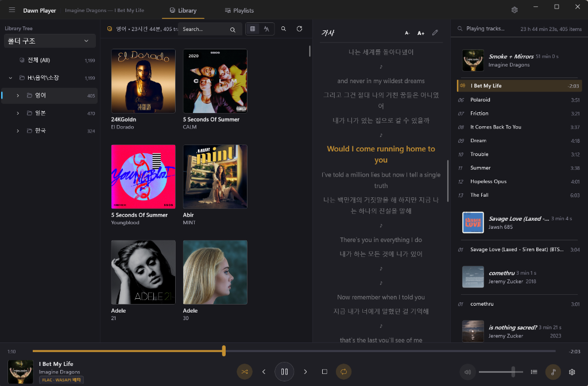

# Dawn Player

<a href="README.md">English</a> · <b>한국어</b> · <a href="README.zh-CN.md">简体中文</a>

foobar2000의 기능성과 [Eole 테마](https://github.com/Ottodix/Eole-foobar-theme)의 디자인에서 영감을 받은
네이티브 Windows 뮤직 플레이어 (WinUI 3 / .NET 10).

## 다운로드

[GitHub Releases](https://github.com/wolfdate25/dawn-player/releases/latest)에서 최신 인스톨러나
포터블 ZIP을 내려받을 수 있습니다 (SHA256 체크섬도 함께 게시). Windows 10 19041 이상이 필요합니다.

- **설치 프로그램 (`.exe`)** — 비관리자(기본) 또는 관리자 모드 설치. 바로가기·시작프로그램 등록,
  오디오 확장자 연결(.mp3, .flac, .wav, .m4a 등), 탐색기 우클릭 재생 메뉴를 등록하고, 실행 중인
  인스턴스를 감지해 안전하게 업그레이드/제거합니다
- **포터블 (`.zip`)** — 압축을 풀어 바로 실행합니다 (설치 불필요)

데이터는 `%AppData%\DawnPlayer`에 저장됩니다 (settings.json, library.db, playlists/, artcache/,
dawnplayer.log). **포터블 모드**: exe 옆에 `portable.dat` 마커가 있으면 `%AppData%` 대신 실행
폴더의 `data\`를 사용합니다 (포터블 ZIP에는 이 마커가 포함되어 있습니다).

## 주요 기능

### 오디오 엔진
- **WASAPI Exclusive 출력** — 비트 퍼펙트 직접 출력. 장치가 형식을 지원하지 않거나 다른 앱이
  장치를 점유 중이면 자동으로 공유 모드로 폴백 (알림 표시)
- **갭리스 재생** — 트랙 경계가 샘플 단위로 이어지는 시퀀서. 다음 트랙 디코더를 미리 열어
  (프리페치) 끊김 없이 체인
- 배타 모드 샘플레이트 불일치 처리 — 트랙 경계에서 세션을 재구성(비트 퍼펙트)하거나 세션을
  유지한 채 리샘플(끊김 없음) 중 선택
- **인터넷 라디오** — Icecast/Shoutcast MP3 스트림 재생 (ICY 메타데이터의 방송국·곡 정보 표시).
  타이틀 메뉴 → 네트워크 스트림 열기, M3U8 안의 URL도 재생목록에 그대로 들어갑니다
- **지원 형식**: MP3, AAC/ALAC(m4a), FLAC, Ogg Vorbis, Opus, WAV, DSF/DSD, DFF(DSDIFF) —
  Media Foundation + NVorbis 디코딩. DSD는 박스카 디시메이션으로 44.1k/48k 계열 PCM 변환 재생 또는
  DSD 대응 DAC에 WASAPI 배타 DoP(DSD over PCM) 패킹 전송
- **CUE 시트 지원** — 앨범 이미지(FLAC/WAV/APE 등) + `.cue`를 스캔하면 트랙 단위 가상 트랙으로 색인해
  곡 단위 재생·통계·평점이 동작하고, 이미지 전체 행은 숨겨집니다 (foobar2000 방식).
  구간 재생은 갭리스 시퀀서 위에서 샘플 단위로 이어집니다
- 배타 모드 비트 깊이 정책 (원본/16/24/32비트), 지연 버퍼 조절 (30~500ms)
- **파라메트릭 이퀄라이저 (장치별 독립 프로필)** — 최대 8밴드 동적 필터(Peak EQ, Low/High Shelf, Low/High Pass), 프리앰프(±12dB), 장치별 개별 프로필 및 공통 기본 프로필 폴백, 재생 중 즉시 라이브 반영 및 비트 퍼펙트 바이패스
- **ReplayGain** (트랙/앨범 게인, 사전 증폭, 클리핑 방지) — FLAC/OGG(Xiph), MP3(ID3v2 TXXX) 태그 지원
- **컨볼루션 (임펄스 응답)** — WAV/FLAC 등 임펄스 파일로 룸·스피커·헤드폰 보정. FFT 파티션
  컨볼루션(512샘플 블록, 2초까지 IR)으로 재생 중 실시간 적용·교체가 가능합니다
  (환경설정 → 재생 → 공간 청취)
- **동적 볼륨 노멀라이저 (AGC)** — 트랙 간 음량 자동 평준화. ReplayGain 태그가 있으면 그 값을 쓰고
  없으면 동적 AGC로 폴백하는 하이브리드 모드, 목표 레벨/최대 부스트/반응 속도 조절, 무음 게이팅
- **헤드폰 크로스피드** (Chu Moy 위상, 약함/보통/강함)와 **모노 다운믹스** — 재생 중 실시간 적용

### 재생목록 / 대기열 (foobar2000 스타일)
- 다중 재생목록 (탭), 이름 변경, M3U8 자동 저장 / 가져오기 / 내보내기
- **스마트 재생목록** — 재생 통계(재생 횟수·마지막 재생·스킵)를 SQLite에 기록해 "많이 재생 /
  최근 추가 / 한동안 안 들은" 자동 재생목록을 생성·갱신 (설정 변경 없이 재생할 때마다 최신화)
- **쿼리 기반 스마트 재생목록** — foobar2000 스타일 쿼리
  (`%rating% GREATER 3 AND %last_played% DURING LAST 30 DAYS LIMIT 50`)로 직접 스마트 재생목록을
  만들고 편집. 문자열(IS/HAS)/수치(GREATER, >=)/날짜(DURING LAST)/MISSING·PRESENT/AND·OR·NOT/괄호 지원
- **트랙 평점** — 0~5개 별점. 재생목록 행에 표시하고 컨텍스트 메뉴에서 지정(다중 선택 일괄 지정),
  ID3v2 POPM / Vorbis·MP4 RATING 태그와 양방향 동기화, 쿼리의 `%rating%` 필드로 활용
- **재생 대기열** — 트랙 단위로 대기열에 추가/선두 추가, 대기열 중심 재생 후 원래 순서로 복귀.
  목록 행에 Q1, Q2… 배지 표시
- 무작위 재생, 반복 (없음/전체/한 곡), 이전 트랙 히스토리, **A-B 반복**(오디오 스레드에서 샘플 단위 루프,
  단축키 바인딩 가능)
- 정렬 (제목/아티스트/앨범·트랙/경로/무작위/역순), 중복 제거, 그룹 묶기 토글 + 평탄 모드 드래그 재정렬

### 라이브러리
- 음악 폴더 색인 (SQLite 저장, 증분 스캔), 아티스트/앨범/장르 필터 브라우저 + 검색
- **WAV 변환기** — 재생목록 트랙을 WAV로 내보내기 (CUE 이미지 분할, ReplayGain 굽기, 태그·아트 동반)
- **태그 편집기** — 트랙/앨범 컨텍스트 메뉴에서 메타데이터·앨범아트 편집, 원자적(파일 교체) 저장
- **ReplayGain 일괄 분석** — EBU R128 라우드니스 스캐너(−18 LUFS)로 곡별·앨범별 게인을 계산해
  태그(REPLAYGAIN_*)와 DB에 기록, 음량 정규화에 즉시 반영.
  **ReplayGain 2.0 태그**(R128_TRACK_GAIN / R128_ALBUM_GAIN) 함께 기록 옵션 및 읽기 폴백 지원
- 앨범아트 캐시 (태그 삽입 이미지 추출 + cover.jpg 등 폴더 아트)
- **커버 그리드 / 목록 테이블 보기 전환** — 그리드 타일 크기 조절(Ctrl+휠) 및 크기 유지
- **청취 리포트** — 재생 이력(play_events)을 기록해 기간별(전체/최근 30일/올해) 총 재생·청취 시간·
  많이 들은 아티스트/앨범/장르/곡 대시보드 제공 (타이틀 메뉴 → 청취 리포트)

### 가사
- **.lrc 동기 가사** — 자동 검색(`음원파일명.lrc`, `아티스트 - 제목.lrc`, `제목.lrc` 및 사용자 패턴),
  현재 줄 강조 + 자동 스크롤, 줄 클릭 시크, ±0.5초 오프셋 조정
- **온라인 가사 플러그인** — .NET DLL 플러그인으로 사이트별 가사 검색 지원.
  플러그인 우선순위 설정·재생 중 자동 검색(오프라인 가사 우선), 제목/아티스트/앨범 검색 창, 미리보기 후 적용,
  온라인 가사를 오프라인 .lrc로 저장 — 저장 위치(음원 폴더/지정 폴더)와 파일명 템플릿(`%title%` 등 변수) 지원
- 표준/멀티 타임스탬프/`[offset:]`/확장(단어 단위) LRC 지원, UTF-8/ANSI 자동 인식
- **LRC 가사 에디터** — 줄 단위 타임스탬프 편집/동기화, 줄 순서 이동, 클립보드에서 가사 가져오기

### UI (Eole 스타일 × WinUI 3 네이처럴)
- 다크 퍼스트 팔레트 + Mica 배경, 앰버 액센트, 밝은 테마 전환
- 다국어 UI — 한국어 / English / 日本語. 환경설정 → 외관 & 테마에서 언어를 선택(시스템 기본 따르기 지원)하면
  재시작 후 전체 UI가 해당 언어로 표시됩니다
- 앨범 단위 그룹 헤더(아트 + 메타)가 있는 재생목록 — eole의 시그니처 레이아웃
- 하단 플레이어 바: 앨범아트, 시크, 트랜스포트, 볼륨, 대기열 배지, 가사 토글
- SMTC 연동 — 미디어 키 / OS 미디어 오버레이 / 볼륨 팝업 제어
- 단축키 17종 — 재생 제어(`Space` 재생/일시정지, `Ctrl+S` 정지, `Ctrl+←/→` 이전/다음, `Ctrl+H` 셔플, `Ctrl+R` 반복, `Ctrl+Shift+S` 곡 종료 후 정지),
  탐색(`←/→` ±5초, `Ctrl+B` 곡 처음으로), 볼륨(`Ctrl+↑/↓`, `Ctrl+M` 음소거), 창(`L` 가사, `Ctrl+F` 검색, `Ctrl+P` 환경설정)
- 단축키 재할당: 환경설정 → 단축키 에서 모든 명령의 키 조합을 바꿀 수 있고(충돌 감지 · 개별/전체 초기화), 변경분만 `settings.json`에 저장됩니다
- **수면 타이머** — 15/30/60분 후 또는 현재 곡이 끝나면 재생 정지 (타이틀 메뉴에서)
- **미니 플레이어** — 타이틀 메뉴에서 항상 위 컴팩트 모드(재생 바만 표시, 배경 드래그로 창 이동, Esc 해제)
- **트레이 토스트** — 트레이로 숨겨둔 상태에서 트랙이 바뀌면 풍선 알림 표시 (Focus Assist 존중)
- **Last.fm 스러블링** — 사용자 API 키로 웹 인증해 재생 곡을 스러블. 네트워크 실패 시 큐에
  쌓아 재시도 (타이틀 메뉴 → Last.fm 스러블링)
- **알림 영역(트레이) 통합** — "트레이로 닫기" 설정 시 닫기 버튼으로 트레이에 숨겨 재생 유지,
  트레이 메뉴로 재생 제어·창 열기·종료, 작업표시줄 썸네일 툴바(이전/재생/다음)
- 파일/폴더 드래그 & 드롭으로 재생목록에 추가

## 크레딧

- [Eole foobar theme](https://github.com/Ottodix/Eole-foobar-theme) — UI 디자인 참조
- [NAudio](https://github.com/naudio/NAudio) / [NVorbis](https://github.com/njdrummond/NVorbis) — 오디오
- [TagLib#](https://github.com/mono/taglib-sharp) — 태그
- foobar2000 — 기능적 영감의 원천
