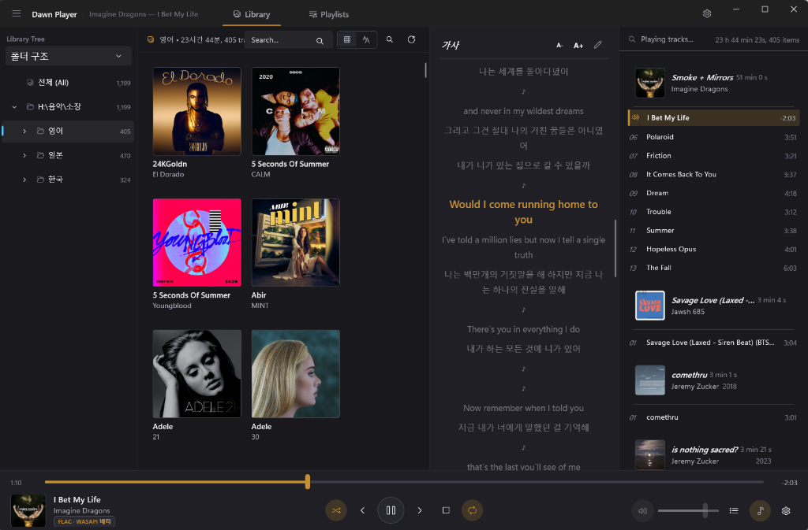

# Dawn Player

foobar2000의 기능성과 [Eole 테마](https://github.com/Ottodix/Eole-foobar-theme)의 디자인에서 영감을 받은
네이티브 Windows 뮤직 플레이어 (WinUI 3 / .NET 10).




## 주요 기능

### 오디오 엔진
- **WASAPI Exclusive 출력** — 비트 퍼펙트 직접 출력. 장치가 형식을 지원하지 않거나 다른 앱이
  장치를 점유 중이면 자동으로 공유 모드로 폴백 (알림 표시)
- **갭리스 재생** — 트랙 경계가 샘플 단위로 이어지는 시퀀서. 다음 트랙 디코더를 미리 열어
  (프리페치) 끊김 없이 체인
- 배타 모드에서 형식(샘플레이트/채널/비트)이 바뀌면 트랙 경계에서 출력 세션 재구성 (foobar 방식과 동일)
- **지원 형식**: MP3, AAC/ALAC(m4a), FLAC, Ogg Vorbis, WAV — Media Foundation + NVorbis 디코딩
- 배타 모드 비트 깊이 정책 (원본/16/24/32비트), 지연 버퍼 조절 (30~500ms)
- **파라메트릭 이퀄라이저 (장치별 독립 프로필)** — 최대 8밴드 동적 필터(Peak EQ, Low/High Shelf, Low/High Pass), 프리앰프(±12dB), 장치별 개별 프로필 및 공통 기본 프로필 폴백, 재생 중 즉시 라이브 반영 및 비트 퍼펙트 바이패스
- **ReplayGain** (트랙/앨범 게인, 사전 증폭, 클리핑 방지) — FLAC/OGG(Xiph), MP3(ID3v2 TXXX) 태그 지원
- **동적 볼륨 노멀라이저 (AGC)** — 트랙 간 음량 자동 평준화. ReplayGain 태그가 있으면 그 값을 쓰고
  없으면 동적 AGC로 폴백하는 하이브리드 모드, 목표 레벨/최대 부스트/반응 속도 조절, 무음 게이팅
- **헤드폰 크로스피드** (Chu Moy 위상, 약함/보통/강함)와 **모노 다운믹스** — 재생 중 실시간 적용
- **실시간 스펙트럼** — 하단 플레이어 바에 28밴드 로그 스펙트럼 (DSP 체인 끝의 샘플 탭에서 FFT)

### 재생목록 / 대기열 (foobar2000 스타일)
- 다중 재생목록 (탭), 이름 변경, M3U8 자동 저장 / 가져오기 / 내보내기
- **스마트 재생목록** — 재생 통계(재생 횟수·마지막 재생·스킵)를 SQLite에 기록해 "많이 재생 /
  최근 추가 / 한동안 안 들은" 자동 재생목록을 생성·갱신 (설정 변경 없이 재생할 때마다 최신화)
- **재생 대기열** — 트랙 단위로 대기열에 추가/선두 추가, 대기열 중심 재생 후 원래 순서로 복귀.
  목록 행에 Q1, Q2… 배지 표시
- 무작위 재생, 반복 (없음/전체/한 곡), 이전 트랙 히스토리, **A-B 반복**(오디오 스레드에서 샘플 단위 루프,
  단축키 바인딩 가능)
- 정렬 (제목/아티스트/앨범·트랙/경로/무작위/역순), 중복 제거, 그룹 묶기 토글 + 평탄 모드 드래그 재정렬

### 라이브러리
- 음악 폴더 색인 (SQLite 저장, 증분 스캔), 아티스트/앨범/장르 필터 브라우저 + 검색
- **태그 편집기** — 트랙/앨범 컨텍스트 메뉴에서 메타데이터·앨범아트 편집, 원자적(파일 교체) 저장
- **ReplayGain 일괄 분석** — EBU R128 라우드니스 스캐너(−18 LUFS)로 곡별·앨범별 게인을 계산해
  태그(REPLAYGAIN_*)와 DB에 기록, 음량 정규화에 즉시 반영
- 앨범아트 캐시 (태그 삽입 이미지 추출 + cover.jpg 등 폴더 아트)
- **커버 그리드 / 목록 테이블 보기 전환** — 그리드 타일 크기 조절(Ctrl+휠) 및 크기 유지

### 가사
- **.lrc 동기 가사** — 자동 검색(`음원파일명.lrc`, `아티스트 - 제목.lrc`, `제목.lrc` 및 사용자 패턴),
  현재 줄 강조 + 자동 스크롤, 줄 클릭 시크, ±0.5초 오프셋 조정
- **온라인 가사 플러그인** — .NET DLL 플러그인으로 사이트별 가사 검색 지원 (개발 가이드: `docs/plugin-development.md`).
  플러그인 우선순위 설정·재생 중 자동 검색(오프라인 가사 우선), 제목/아티스트/앨범 검색 창, 미리보기 후 적용,
  온라인 가사를 오프라인 .lrc로 저장 — 저장 위치(음원 폴더/지정 폴더)와 파일명 템플릿(`%title%` 등 변수) 지원
- 표준/멀티 타임스탬프/`[offset:]`/확장(단어 단위) LRC 지원, UTF-8/ANSI 자동 인식
- **LRC 가사 에디터** — 줄 단위 타임스탬프 편집/동기화, 줄 순서 이동, 클립보드에서 가사 가져오기

### UI (Eole 스타일 × WinUI 3 네이처럴)
- 다크 퍼스트 팔레트 + Mica 배경, 앰버 액센트, 밝은 테마 전환
- 다국어 UI — 한국어 / English / 日本어. 환경설정 → 외관 & 테마에서 언어를 선택(시스템 기본 따르기 지원)하면
  재시작 후 전체 UI가 해당 언어로 표시됩니다 (`Strings/<culture>/Resources.resw` + MRT Core)
- 앨범 단위 그룹 헤더(아트 + 메타)가 있는 재생목록 — eole의 시그니처 레이아웃
- 하단 플레이어 바: 앨범아트, 시크, 트랜스포트, 볼륨, 대기열 배지, 가사 토글
- SMTC 연동 — 미디어 키 / OS 미디어 오버레이 / 볼륨 팝업 제어
- 단축키 17종 — 재생 제어(`Space` 재생/일시정지, `Ctrl+S` 정지, `Ctrl+←/→` 이전/다음, `Ctrl+H` 셔플, `Ctrl+R` 반복, `Ctrl+Shift+S` 곡 종료 후 정지),
  탐색(`←/→` ±5초, `Ctrl+B` 곡 처음으로), 볼륨(`Ctrl+↑/↓`, `Ctrl+M` 음소거), 창(`L` 가사, `Ctrl+F` 검색, `Ctrl+P` 환경설정)
- 단축키 재할당: 환경설정 → 단축키 에서 모든 명령의 키 조합을 바꿀 수 있고(충돌 감지 · 개별/전체 초기화), 변경분만 `settings.json`에 저장됩니다
- **수면 타이머** — 15/30/60분 후 또는 현재 곡이 끝나면 재생 정지 (타이틀 메뉴에서)
- **알림 영역(트레이) 통합** — "트레이로 닫기" 설정 시 닫기 버튼으로 트레이에 숨겨 재생 유지,
  트레이 메뉴로 재생 제어·창 열기·종료, 작업표시줄 썸네일 툴바(이전/재생/다음)
- 파일/폴더 드래그 & 드롭으로 재생목록에 추가

## 빌드 및 실행

요구 사항: .NET SDK 10 (`global.json`으로 고정 — `.slnx` 솔루션 형식은 SDK 9.0.2xx 이상이 필요합니다),
Windows 10 19041 이상

```powershell
dotnet build DawnPlayer.slnx -c Debug
# 실행
src/DawnPlayer.App/bin/Debug/net10.0-windows10.0.19041.0/win-x64/DawnPlayer.App.exe
```

언패키지드(비 MSIX) + Windows App SDK 셀프 컨테인드로 빌드되어 별도 런타임 설치 없이 exe를 바로
실행할 수 있습니다.

### 배포 패키지 및 인스톨러 빌드

Inno Setup 6 기반의 설치 프로그램(`Setup.exe`) 및 무설치 포터블 ZIP 아카이브를 자동으로 빌드할 수 있습니다.

```powershell
# Inno Setup 6 설치 (최초 1회)
winget install --id JRSoftware.InnoSetup

# 인스톨러 및 포터블 ZIP 자동 빌드 (버전 지정)
pwsh -File tools/build-installer.ps1 -Version "1.0.0"
```

- **설치 프로그램 (`.exe`)**: `dist/installer/DawnPlayer-Setup-v1.0.0-x64.exe`
  - 비관리자(기본) 및 관리자 모드 설치 지원
  - 바로가기, 시작프로그램, 오디오 확장자 연결(.mp3, .flac, .wav, .m4a 등), 우클릭 재생 메뉴 자동 등록
  - 실행 중 프로세스 자동 감지 및 안전한 업그레이드/제거 지원
- **포터블 아카이브 (`.zip`)**: `dist/DawnPlayer-v1.0.0-portable-win-x64.zip`
  - 설치 없이 압축 해제 후 즉시 실행 가능

### GitHub 배포 및 CI/CD

GitHub Actions를 통해 코드 검증과 릴리스 배포가 완전 자동화되어 있습니다.

- **CI (`.github/workflows/ci.yml`)**:
  - `main` 대상 Push 및 Pull Request 시 Debug/Release 빌드, 전체 테스트 및 커버리지 수집,
    인스톨러 패키징 dry-run 검증.
- **CodeQL (`.github/workflows/codeql.yml`)**: C# 정적 분석 (Push/PR 및 주간 스케줄).
- **CD Release (`.github/workflows/release.yml`)**:
  - Git 태그 푸시(`git tag v1.0.0 && git push origin v1.0.0`) 또는 GitHub Actions 웹 UI에서 수동 트리거.
  - 단위 테스트 통과 검증 후 Inno Setup 인스톨러, 포터블 ZIP, `SHA256SUMS.txt`를 생성하여 GitHub Releases에 자동 배포.

데이터 위치: `%AppData%\DawnPlayer` (settings.json, library.db, playlists/, artcache/, dawnplayer.log).
**포터블 모드**: exe 옆에 `portable.dat`가 있으면 `%AppData%` 대신 실행 폴더의 `data\`를 사용합니다
(포터블 ZIP에는 이 마커가 포함되어 있고, 인스톨러 빌드에는 포함되지 않습니다).

## 아키텍처

```
src/
├── DawnPlayer.Core/            # 오디오/데이터 엔진 (UI 독립)
│   ├── Audio/                  # WASAPI 출력, 갭리스 시퀀서, 디코더, 포맷 협상
│   ├── Playlists/              # 재생목록, 재생 대기열, m3u8 영속화
│   ├── Library/                # SQLite 라이브러리, 태그/리플레이게인/아트 스캐너
│   ├── Lyrics/                 # LRC 파서/파인더
│   └── Persistence/            # 설정(JSON)
└── DawnPlayer.App/             # WinUI 3 UI
    ├── Controls/               # NowPlayingBar, LyricsPane
    ├── Views/                  # Library / Playlist / Settings 페이지
    └── Services/               # 조합 루트, SMTC, 스레드 마샬링
tests/DawnPlayer.Tests/         # 코어/서비스/뷰모델 단위 테스트, 동시성·적대적 테스트,
                                # FlaUI 기반 E2E UI 자동화
```

재생 파이프라인: `파일 → 디코더(MF/Vorbis) → float → [볼륨·ReplayGain] → [리샘플] → [채널 변환]
→ [Equalizer (장치별/공통)] → [DynamicNormalizer] → [SoftLimiter] → PCM 변환
→ SequencerStream(갭리스 체인) → WasapiOut(Exclusive/Shared)`

## 로드맵

- DSP 체인 확장 — 크로스피드·모노 다운믹스·스펙트럼 완료
- Converter (형식 변환/리핑)
- 재생목록 간 드래그 & 드롭 (스마트 재생목록은 완료)
- 태그 편집기 — 완료 (ReplayGain 일괄 분석 포함)
- 바이오그래피/가사 온라인 조회
- 다국어 리소스 분리 — 완료 (MRT Core resw 3개 언어)

## 크레딧

- [Eole foobar theme](https://github.com/Ottodix/Eole-foobar-theme) — UI 디자인 참조
- [NAudio](https://github.com/naudio/NAudio) / [NVorbis](https://github.com/njdrummond/NVorbis) — 오디오
- [TagLib#](https://github.com/mono/taglib-sharp) — 태그
- foobar2000 — 기능적 영감의 원천
